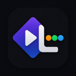

  

<h1 align="center">LetterStremio</h1>

  <b>Bridging Letterboxd with your Stremio Experience</b>

  
  
  

---

### 🌍 Language / اللغة
[**English**](#english-description) | [**العربية**](#الوصف-باللغة-العربية)

---

## English Description

**LetterStremio** seamlessly connects Letterboxd.com with **Stremio**, adding professional, integrated buttons to every film page.

### 🎬 How it Works
1.  **Browse** films and reviews on Letterboxd as usual.
2.  Beautifully integrated **Stremio buttons** appear automatically on the film's right sidebar.
3.  Instantly open titles in the **Stremio Desktop App**, **Stremio Web**, or **Add to Library** directly!

### ✨ Features
*   📚 **Add to Library**: Sync films directly to your Stremio account without leaving the browser! (Requires one-time secure login).
*   🖥️ **Watch App & Web**: Open titles directly in the Stremio Desktop client or web.stremio.com.
*   🎯 **Smart Detection**: Works on all Letterboxd film and review pages, distinguishing between Movies and TV Series.
*   🎨 **Native Design**: Matches Letterboxd's dark theme perfectly.

---

## الوصف باللغة العربية

إضافة **LetterStremio** تربط موقع Letterboxd بتطبيق **Stremio** بكل سلاسة، من خلال إضافة أزرار مدمجة واحترافية في كل صفحة فيلم.

### 🎬 كيف تعمل؟
1.  **تصفّح** الأفلام والمراجعات على Letterboxd بشكل طبيعي.
2.  تظهر أزرار **Stremio** مدمجة بأناقة في الشريط الجانبي لكل فيلم.
3.  بضغطة زر يمكنك فتح الفيلم في **تطبيق Stremio للكمبيوتر**، أو **نسخة الويب**، أو **إضافته لمكتبتك** مباشرة!

### ✨ المميزات
*   📚 **الإضافة للمكتبة**: أضف الأفلام لمكتبة Stremio الخاصة بك مباشرة دون مغادرة المتصفح! (تتطلب تسجيل الدخول مرة واحدة عبر الإضافة بأمان).
*   🖥️ **المشاهدة عبر التطبيق والويب**: افتح المحتوى فوراً في تطبيق Stremio المشغل على جهازك أو عبر web.stremio.com.
*   🎯 **اكتشاف ذكي**: تعمل على صفحات الأفلام ومراجعات المستخدمين، وتفرّق تلقائياً بين الأفلام والمسلسلات.
*   🎨 **تصميم أصلي**: تصميم الأزرار متطابق تماماً مع الثيم الداكن لـ Letterboxd لتبدو وكأنها جزء من الموقع.

---

## 📦 Installation / التثبيت

1. **Download** or clone this repository.
2. Open Chrome and navigate to `chrome://extensions/`.
3. Enable **Developer mode** (top right).
4. Click **"Load unpacked"** and select this folder.

---

## 🔒 Privacy & Security / الخصوصية والأمان

This extension requests minimal permissions. Your Stremio authentication data is stored locally and securely. We do **NOT** track you or collect any personal browsing data. Open source: [https://github.com/3-pr/LetterStremio](https://github.com/3-pr/LetterStremio)

---

  Made with ❤️ for the Stremio community

